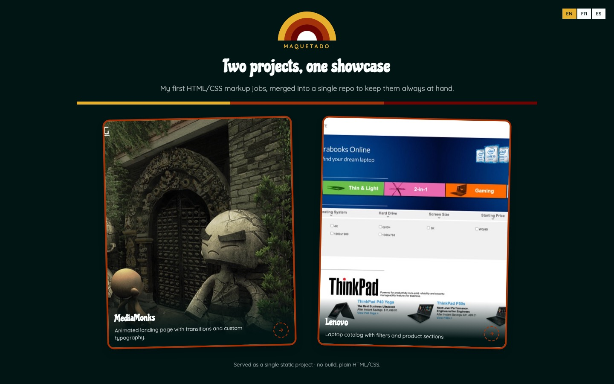
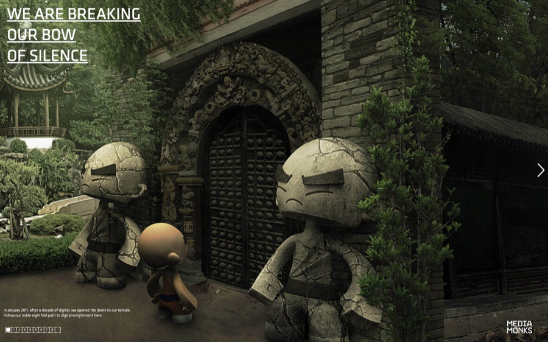
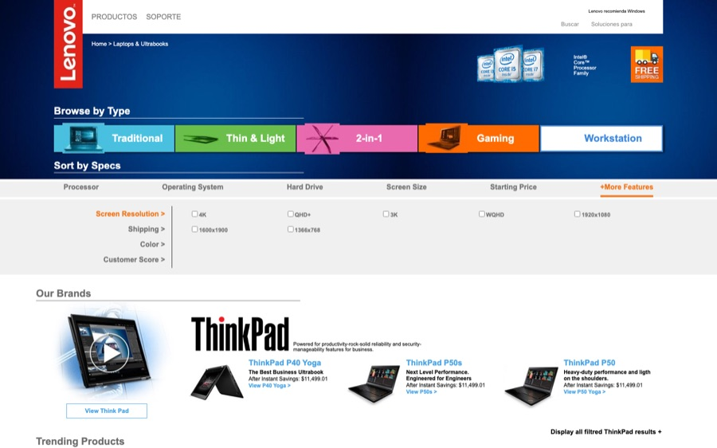

# Maquetado

Two of my first static markup jobs (HTML/CSS), originally built as hiring-process exercises, brought together here into one repo with a shared landing page.

**Live demo:** [maquetado-five.vercel.app](https://maquetado-five.vercel.app/)

## Structure

- `index.html` — landing page linking to both projects.
- `MediaMonks/` — animated landing page, HTML/SCSS/TS.
- `Lenovo/` — laptop catalog page, plain HTML/CSS.
- `preview/` — screenshots used as thumbnails on the landing page.



| MediaMonks | Lenovo |
| --- | --- |
|  |  |
- `favicon.svg` / `favicon.png` / `apple-touch-icon.png` — landing page favicon.
- `.gitignore` — ignores `.DS_Store`.

Neither project has a build step: it's HTML/CSS (plus hand-compiled JS in MediaMonks's case) served as-is.

## Running it locally

You need to serve it from the repo root — don't open `index.html` by double-clicking it, since the absolute (`/`-prefixed) links won't resolve over `file://`:

```
npx serve
```

then open the URL the terminal prints out.

## Deploy

Meant to be deployed as a single project (e.g. on Vercel), serving the repo root as-is with no build step.

## Notes

- `Lenovo/` is only laid out for desktop (≥1200px), with no responsive design — that was the original brief. More detail in [`Lenovo/README.txt`](Lenovo/README.txt).
- The landing page (`index.html`) is responsive and has a language switcher (EN/FR/ES).
